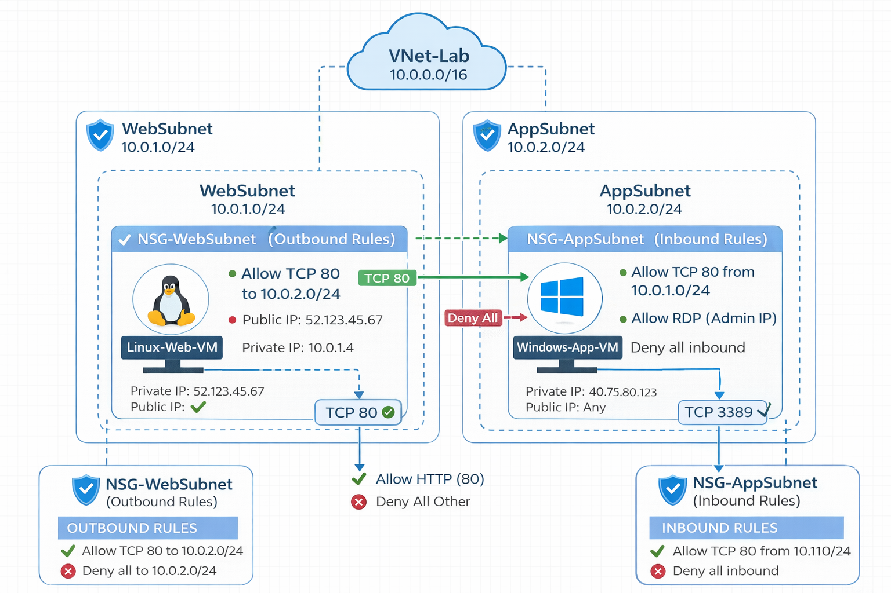
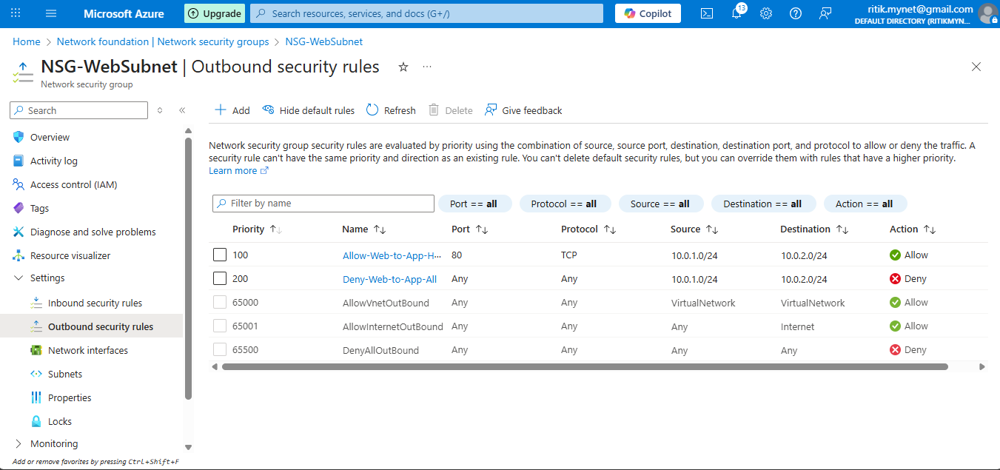
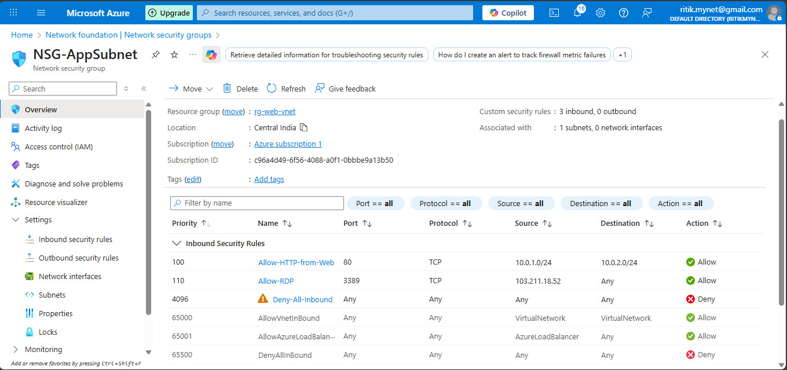
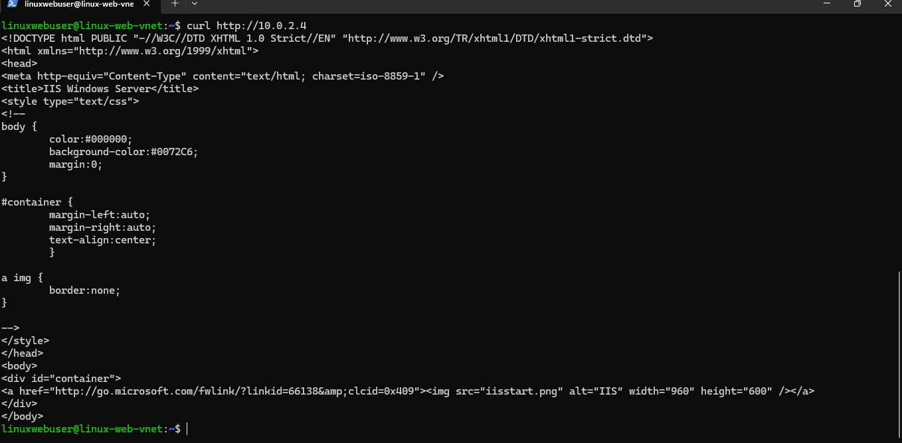

# Azure VNet & NSG Communication Lab (AZ-104)

This project demonstrates **Azure Virtual Network (VNet) design and Network Security Group (NSG) configuration**
to control traffic between subnets, and allow access port and HTML Web Page from linux VM

---

## 📌 Architecture Overview

- **VNet:** 10.0.0.0/16
- **WebSubnet:** 10.0.1.0/24 (Linux VM)
- **AppSubnet:** 10.0.2.0/24 (Windows VM)

### Traffic Requirement
- Allow **HTTP (80)** from WebSubnet → AppSubnet
- Deny all other traffic between subnets
- Allow **RDP (3389)** from admin IP only
- Maintain SSH access to Linux VM

---

## 🗺️ Architecture Diagram

---

## 🧩 Resources Created

| Resource | Name |
|--------|-----|
| Resource Group | rg-webvnet-Lab |
| Virtual Network | web-vnet-Lab |
| Linux VM | linux-web-vnet |
| Windows VM | win-app-vnet |
| NSG (Web) | NSG-WebSubnet |
| NSG (App) | NSG-AppSubnet |

---

## 🔐 Network Security Group Design

### NSG-WebSubnet (Outbound Rules)

| Priority | Rule | Action |
|--------|-----|------|
| 100 | Allow TCP 80 to 10.0.2.0/24 | Allow |
| 200 | Deny all to 10.0.2.0/24 | Deny |

---

### NSG-AppSubnet (Inbound Rules)

| Priority | Rule | Action |
|--------|-----|------|
| 100 | Allow TCP 80 from 10.0.1.0/24 | Allow |
| 110 | Allow RDP from Admin IP | Allow |
| 65500 | Deny all inbound | Deny |

---

## 🧪 Validation Tests

### From Linux VM (WebSubnet)
bash/powersehll
- curl http://<WINDOWS_PRIVATE_IP>

---

## ✅ Expected Result
- HTML output of IIS Welcome Page
- Status 200 OK

✔️ This proves:
- Port 80 is allowed
- WebSubnet → AppSubnet HTTP rule is working

