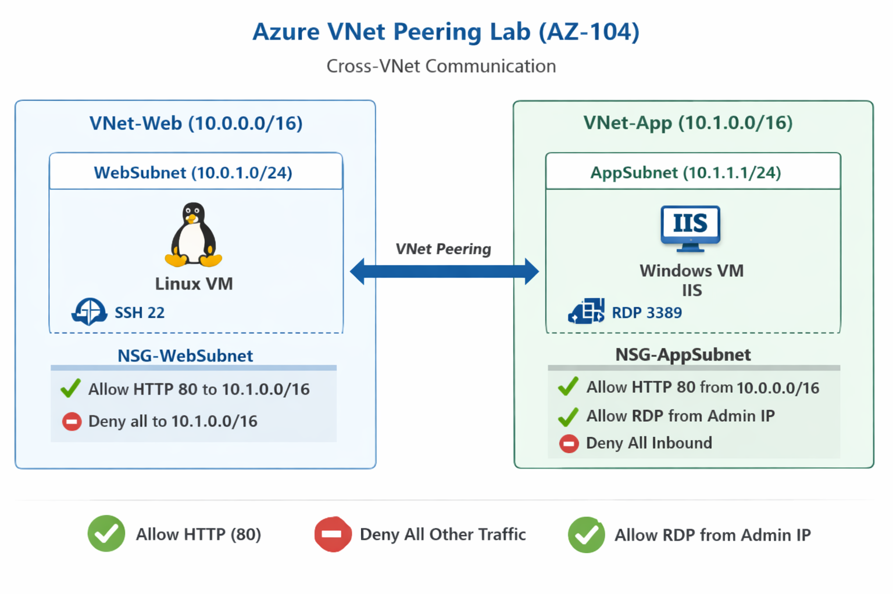
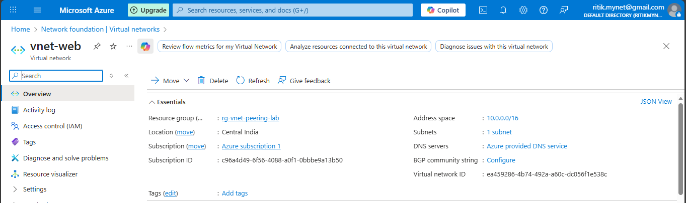
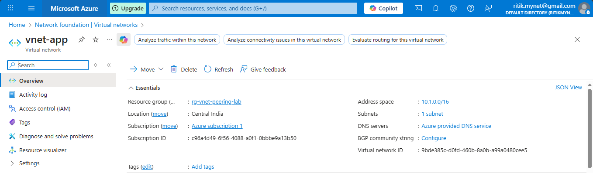
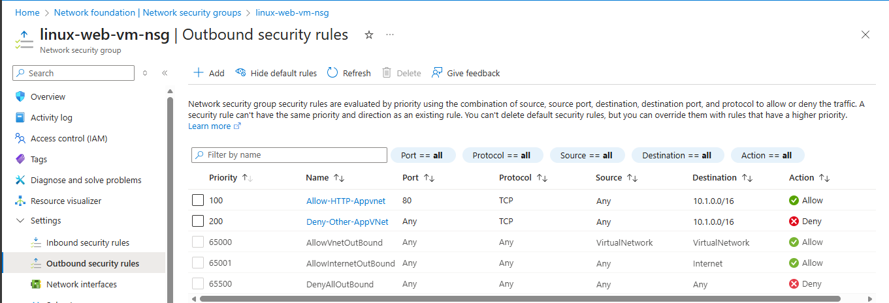
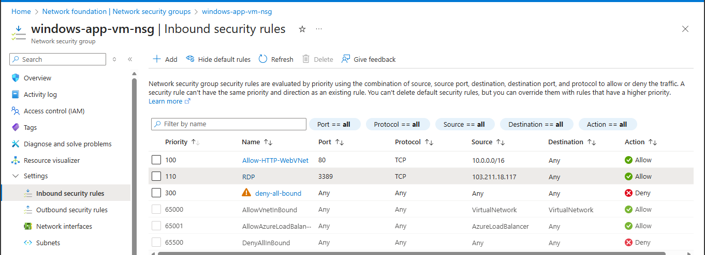
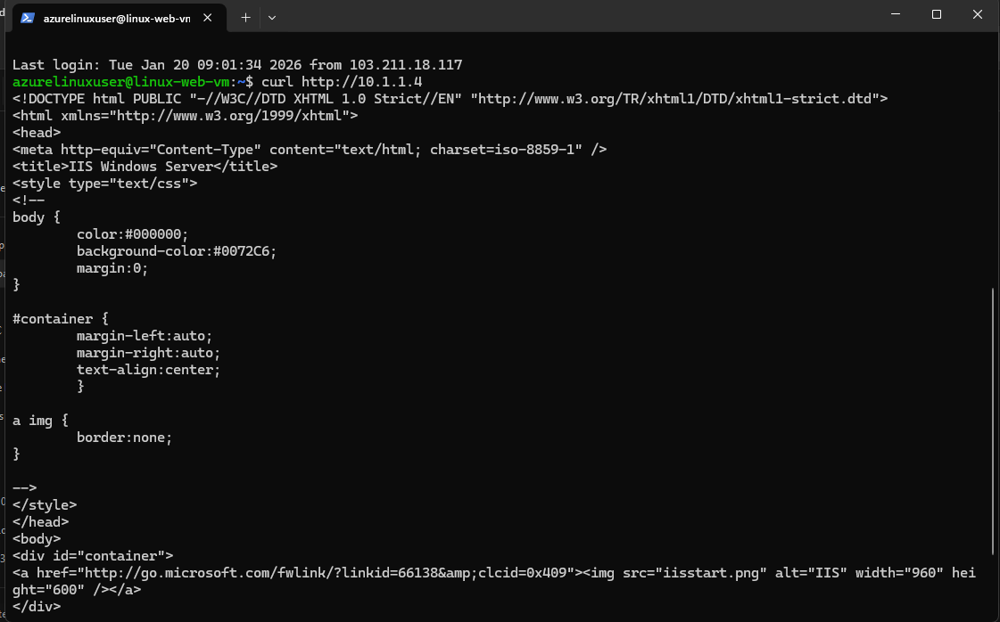

# Azure VNet Peering Lab (AZ-104)

## 📌 Project Overview

This lab demonstrates **Azure Virtual Network (VNet) Peering** to enable secure, private communication between isolated VNets. The implementation follows **AZ-104 (Microsoft Azure Administrator)** networking objectives and builds on the **VNet & NSG Communication Lab**.

---

## 🏗️ Architecture Overview

### Virtual Networks

- **VNet-Web**: `10.0.0.0/16`
  - WebSubnet: `10.0.1.0/24`
  - Linux VM (Web Tier)

- **VNet-App**: `10.1.0.0/16`
  - AppSubnet: `10.1.1.0/24`
  - Windows VM (Application Tier)

---

## 🗺️ Architecture Diagram

---

### Connectivity Model

- **VNet Peering** between VNet-Web ↔ VNet-App  
- Traffic flows privately over the Azure backbone  
- No public IP exposure for inter-VNet communication  

---

## 🔁 Traffic Requirements

- ✅ Allow HTTP (Port 80) from Web VNet → App VNet  
- ❌ Block all other unnecessary traffic  
- ✅ Allow RDP (3389) only from Admin IP  
- ✅ Maintain SSH access to Linux VM  

---

## 🧩 Azure Resources Deployed

| Resource Type   | Name                  |
|-----------------|-----------------------|
| Resource Group  | `rg-vnet-peering-lab` |
| Virtual Network | `vnet-web`            |
| Virtual Network | `vnet-app`            |
| Linux VM        | `linux-web-vm`        |
| Windows VM      | `windows-app-vm`      |
| NSG             | `nsg-web-subnet`      |
| NSG             | `nsg-app-subnet`      |
| VNet Peering    | `web-to-app-peering`  |
| VNet Peering    | `app-to-web-peering`  |

---

## 🔗 VNet Peering Configuration

### Peering Settings (Both Directions)

- ✔️ Allow Virtual Network Access: **Enabled**
- ❌ Allow Forwarded Traffic: **Disabled**
- ❌ Allow Gateway Transit: **Disabled**
- ❌ Use Remote Gateway: **Disabled**

✔️ Ensures secure and controlled communication without transitive routing.

---

## 🔐 Network Security Group Rules

### Web Subnet – Outbound Rules

| Priority | Rule                       | Action |
|---------|----------------------------|--------|
| 100     | Allow TCP 80 → 10.1.0.0/16 | Allow  |
| 200     | Deny all → 10.1.0.0/16     | Deny   |

### App Subnet – Inbound Rules

| Priority | Rule                          | Action |
|---------|-------------------------------|--------|
| 100     | Allow TCP 80 from 10.0.0.0/16 | Allow  |
| 110     | Allow RDP from Admin IP       | Allow  |
| 65500   | Deny all inbound              | Deny   |

---

## 🧪 Validation & Testing

### Test from Linux VM (Web VNet)
1. SSH into Linux VM:
   - ssh azureuser@<LINUX_WEB_VM_PUBLIC_IP>

   

2. Test HTTP access to Windows VM (App VNet):
   - curl http://<WINDOWS_PRIVATE_IP>

   
   
---

## ✅ Expected Result
- IIS Welcome Page
- HTTP Status 200 OK

---

## ✔️ Confirms:
- VNet peering is functional
- NSG rules are correctly enforced
- Secure inter-VNet communication
