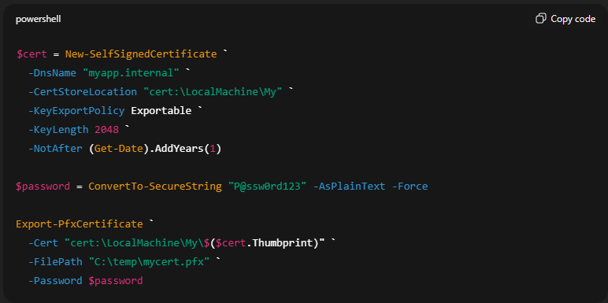

## 🔹 Step 1: Create Virtual Network

1. Go to **Azure Portal → Virtual Networks → Create**
2. Configure:
   - Name: `vnet-appgw`
   - Address space: `10.0.0.0/16`

3. Create subnets:

| Subnet Name | Address Range |
|------------|---------------|
| `appgw-subnet` | `10.0.0.0/24` |
| `backend-subnet` | `10.0.1.0/24` |

📌 Application Gateway **must be deployed in a dedicated subnet**.

---

## 🔹 Step 2: Create 2 Backend Linux VM with the same configuration

1. Go to **Virtual Machines → Create**
2. Configure:
   - OS: Ubuntu 20.04 LTS
   - Size: Standard B1s
   - VNet: `vnet-appgw`
   - Subnet: `backend-subnet`

3. Allow inbound ports:
   - SSH (22)
   - HTTP (80)

---

## 🔹 Step 3: Install Apache & Application Pages

1. SSH into the Linux VM:

``bash
- sudo apt update
- sudo apt install apache2 -y

2. Create application directories:

``bash
- sudo mkdir /var/www/html/app1
- sudo mkdir /var/www/html/app2

3. Create App1 page:
- sudo nano /var/www/html/app1/index.html
- App1 - HTTPS via Application Gateway

4. Create App2 page:
- sudo nano /var/www/html/app2/index.html
- App2 - HTTPS via Application Gateway

---

## 🔹 Step 4: Create Self-Signed Certificate (PFX)
- Run PowerShell as Administrator on your local machine:

- Output file
  C:\temp\mycert.pfx

---

## 🔹 Step 5: Create Application Gateway (WAF v2)

1. Go to Azure Portal → Application Gateways → Create

2. Basics:
   - Name: appgw-waf
   - Tier: WAF V2
   - Region : Same as vnet
     
4. Networking:
   - Virtual network: vnet-appgw
   - Subnet: appgw-subnet
   - Public IP: Create new

---

## 🔹 Step 6: Configure HTTPS Listener
1. Go to Application Gateway → Listeners → Add
2. Configure:
   - Protocol: HTTPS
   - Port: 443
   - Listener type: Basic
   - Certificate: Upload
   - PFX file: mycert.pfx
   - Password: (certificate password)
  
---

## 🔹 Step 7: Configure Backend Pool
1. Go to Backend pools → Add
2. Configure:
   - Target type: IP address
   - Backend IP: Private IP of Linux VM
  
---

## 🔹 Step 8: Configure HTTP Settings
1. Go to HTTP settings → Add
2. Configure:
   - Protocol: HTTP
   - Port: 80
   - Cookie-based affinity: Disabled
  
--- 

## 🔹 Step 9: Configure Path-Based Routing (L7)
1. Go to Rules → Add
2. Rule type: Path-based
3. Listener: HTTPS (443)
   - Add routing paths:

| Path | Backend Pool | HTTP Setting |
|------------|---------------| ----------------|
| `/app1/*` | `backend-pool` | `http-setting` |
| `/app2/*` | `backend-pool` | `http-setting` |

---

## 🔹 Step 10: Enable Web Application Firewall (WAF)
1. Go to Web Application Firewall
2. Configure:
   - WAF Status: Enabled
   - Firewall mode: Detection
   - Rule set: OWASP 3.2

📌 Detection mode logs threats without blocking traffic.

---

## 🔹 Step 11: Test HTTPS Access
- Access the application using the Application Gateway public IP:
- https://application-gateway-public-ip/app1/
  

- https://application-gateway-public-ip/app2/

---

## ✅ Expected Result:
- App1 and App2 pages load successfully
- Browser shows Not Secure (expected for self-signed certificate)

