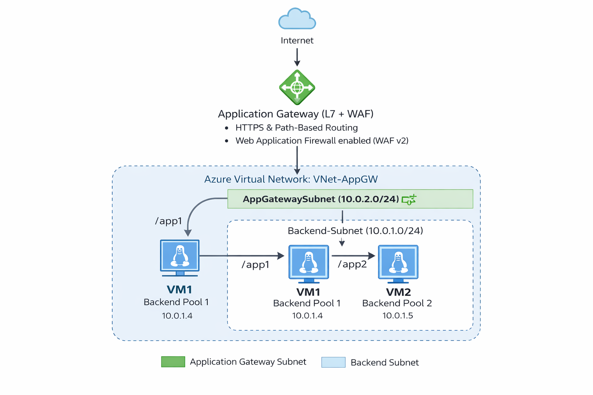
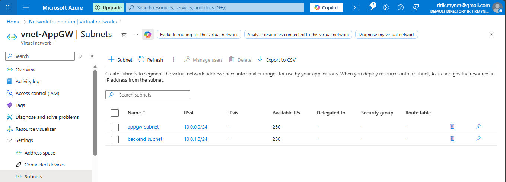
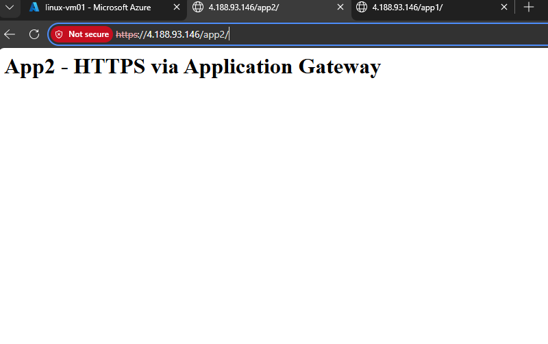

# 🚀 Azure Application Gateway (Layer 7 + WAF) Lab

## 📌 Project Overview
This lab demonstrates **enterprise-grade HTTP/HTTPS traffic management** using **Azure Application Gateway (WAF v2)**.  
It covers **Layer-7 routing**, **path-based rules**, **HTTPS termination**, and **Web Application Firewall (WAF)** protection, aligned with **AZ-104 (Microsoft Azure Administrator)** objectives.

---

## 🎯 Objectives
- Deploy Azure Application Gateway (WAF v2)
- Configure HTTPS listener with SSL certificate
- Implement **path-based routing**
- Protect applications using **OWASP WAF rules**
- Route traffic securely to backend virtual machines

---

## ✅ Key Features Implemented
- Application Gateway (Layer 7)
- Web Application Firewall (WAF v2)
- HTTPS Listener (TLS termination)
- Self-signed certificate (PFX)
- Path-based routing (/app1, /app2)
- Linux VM backend (Apache)
- End-to-end HTTPS traffic flow

---

## 🏗️ Architecture Diagram

---

## 🛠️ Azure Services Used
- Azure Application Gateway (WAF v2)
- Azure Virtual Network (VNet)
- Azure Virtual Machines (Linux)
- Azure Web Application Firewall
- Azure Public IP
- Network Security Groups (NSG)

---

## 🌐 Network Design

| Resource | Configuration |
|-------|--------------|
| VNet | 10.0.0.0/16 |
| AppGatewaySubnet | 10.0.2.0/24 (Dedicated) |
| Backend Subnet | 10.0.1.0/24 |
| App Gateway Tier | WAF v2 |
| Protocol | HTTPS (443) |

---

## 🖥️ Backend Setup

### VM-App1
- Linux VM (Apache Web Server)
- Serves `/app1` traffic

``bash
- sudo mkdir /var/www/html/app1
- sudo nano /var/www/html/app1/index.html
- h1 App1 - HTTPS via Application Gateway /h1

### VM-App2
- Linux VM (Apache Web Server)
- Serves `/app2` traffic

``bash
- sudo mkdir /var/www/html/app2
- sudo nano /var/www/html/app1/index.html
-  h1 App2 - HTTPS via Application Gateway /h1

---

## 🛡️ Web Application Firewall (WAF)

- Mode: Prevention
- Rule Set: OWASP 3.2
- Protects against:
          - SQL Injection
          - Cross-Site Scripting (XSS)
          - Common web exploits

  ---

## ✅ Validation & Testing
- Access the Application Gateway public IP
- Access this from your browser:
        - "https://Application-Gateway-Public-IP/app1"
        - "https://Application-Gateway-Public-IP/app2"

