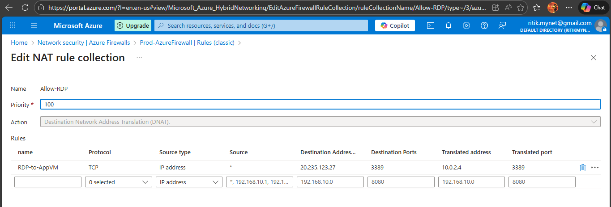
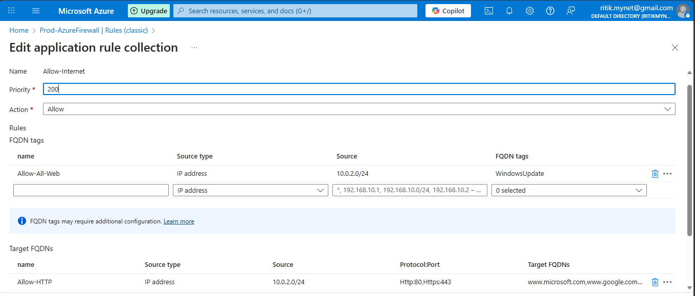
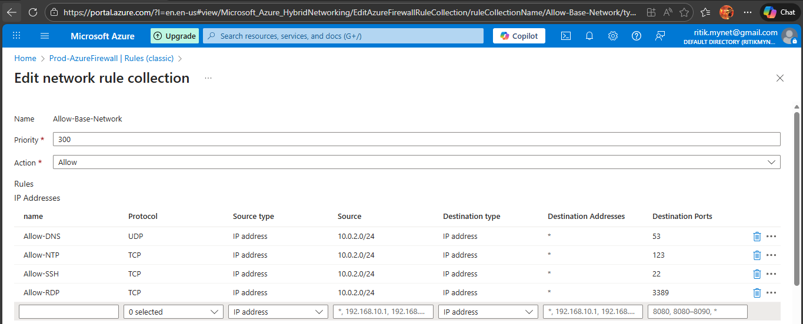

# Azure Firewall + User Defined Route (UDR) – Step-by-Step Lab Guide

## 🔹 Step 1: Create Resource Group
- Name: rg-azure-afw
- Region: Central India

---

## 🔹 Step 2: Create Virtual Network
- Name: afw-vnet
- Address space: 10.0.0.0/16

### Subnets
| Subnet Name | Address Range |
|------------|---------------|
| AzureFirewallSubnet | 10.0.0.0/24 |
| AzureFirewallManagementSubnet | 10.0.1.0/24 |
| AppSubnet | 10.0.2.0/24 |

⚠️ AzureFirewallSubnet name is mandatory.

---

## 🔹 Step 3: Create Public IP for Firewall
- Name: FW-Public-IP
- SKU: Standard
- Assignment: Static
- Tier: Regional

---

## 🔹 Step 4: Deploy Azure Firewall
- Name: Prod-AzureFirewall
- SKU: Standard
- VNet: afw-vnet
- Public IP: FW-Public-IP

---

## 🔹 Step 5: Create Windows VM (AppSubnet)
- Name: win-vm
- Image: Windows Server 2025 Datacenter
- Size: Standard_B1s
- Subnet: AppSubnet
- Public IP: Enabled (testing only)
- NSG: Allow RDP

---

## 🔹 Step 6: Create Route Table (UDR)
- Name: AppSubnet-UDR
- Region: Central India

---

## 🔹 Step 7: Add Default Route to Firewall
- Address prefix: 0.0.0.0/0
- Next hop type: Virtual appliance
- Next hop IP: Firewall Private IP (example: 10.0.0.4)

---

## 🔹 Step 8: Associate UDR with AppSubnet
- VNet: afw-vnet
- Subnet: AppSubnet

✅ All outbound traffic now flows through Firewall

---

## 🔹 Step 9: Configure Azure Firewall Rules

### 1️⃣ NAT Rule – RDP
- DNAT TCP 3389
- Firewall Public IP → VM Private IP

### 2️⃣ Application Rule – Web Access
- Source: 10.0.2.0/24
- Protocols: HTTP, HTTPS
- Target FQDN: www.google.com, www.microsoft.com, www.youtube.com

### 3️⃣ Network Rules
| Purpose | Protocol | Port |
|------|---------|------|
| DNS | UDP | 53 |
| NTP | UDP | 123 |
| SSH | TCP | 22 |
| RDP | TCP | 3389 |

---

## 🔹 Step 10: Verify RDP via Firewall
- Use Firewall Public IP in RDP client
- VM should connect successfully

---

## 🔹 Step 11: Testing Checklist
From AppSubnet VM:

- ping 8.8.8.8 ❌
- curl google.com ✅
- nslookup google.com ✅
- ssh user@x.x.x.x ✅

---

## 🎯 Outcome
✔ Secure inbound & outbound traffic  
✔ Centralized firewall inspection  
✔ Enterprise-grade Azure networking design

