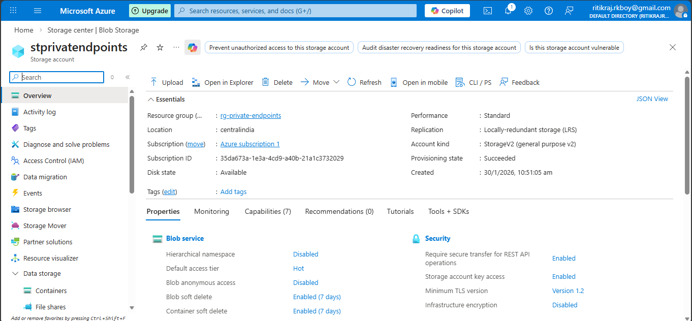

## 🛠 Step-by-Step Implementation

---

## 🔹 Step 1: Create Resource Group

- **Name:** `rg-service-endpoint1`
- **Region:** Central India

---

## 🔹 Step 2: Create Virtual Network & Subnet

### Virtual Network
- **Name:** `vnet-privateendpoint`
- **Address Space:** `10.0.0.0/16`

### Subnet
- **Name:** `AppSubnet`
- **Address Range:** `10.0.2.0/24`

⚠️ **Do NOT enable Service Endpoints**

---

## 🔹 Step 3: Create Azure Storage Account

**Storage Accounts → Create**

### Basics
- **Name:** `stprivatendpoints`
- **Region:** Same as VNet
- **Performance:** Standard
- **Redundancy:** LRS

### Networking
- **Network access:** Public endpoint  
- **Access:** All networks *(temporary)*

✅ Create the storage account

📸 Screenshot:  

---

## 🔹 Step 4: Create Private Endpoint (MOST IMPORTANT)

### Open Storage Account  
**Networking → Private endpoint connections → + Private endpoint**

### Basics
- **Name:** `pe-storage`
- **Region:** Same as VNet

### Resource
- **Resource type:** `Microsoft.Storage/storageAccounts`
- **Resource:** `stprivatendpoints`
- **Target sub-resource:** ✅ `blob`

### Networking
- **Virtual network:** `vnet-privateendpoint`
- **Subnet:** `AppSubnet`

📌 Azure automatically assigns a **private IP**

### DNS (VERY IMPORTANT)
- **Integrate with private DNS zone:** ✅ Yes  
- **Private DNS zone created:** privatelink.blob.core.windows.net

✅ Review + Create → **Private Endpoint deployed**

---

## 🔹 Step 5: Disable Public Access (ZERO EXPOSURE)

**Storage Account → Networking → Firewalls and virtual networks**

- **Public network access:** ❌ Disabled  
- **Save**

🚫 Storage is no longer accessible from the internet

---

## 🔹 Step 6: Deploy Test VMs (Inside VNet)

Create **Windows & Linux VM**

### Network Configuration
- **VNet:** `vnet-privateendpoint`
- **Subnet:** `AppSubnet`
- **Public IP:** Optional (for testing only)

---

## 🔹 🧪 Step 7: Validation & Testing

---

### ❌ Test 1: From Local PC (Should FAIL)

Try:
- Azure Portal → Storage Account → Containers
- Azure Storage Explorer

**Expected Error:**
403 Forbidden
Public network access is disabled

📸 Screenshot:  

----

✅ **Correct behavior**

---

### ✅ Test 2: From Windows VM (Should PASS)

1. RDP into Windows VM
2. Open browser
3. Go to: https://portal.azure.com
4. Navigate to:
   - Storage Account → Containers
5. Create container / upload blob

✅ **SUCCESS**
- Access allowed
- Data loads correctly

📸 Screenshot:  

---

### ✅ Test 3: Confirm Private IP (DNS Validation)

#### Login to Linux VM
``bash: 
- ssh -i <private-key-path> azureuser@<vm-public-ip>

### Test DNS Resolution
``bash:
1. nslookup stprivatendpoints.blob.core.windows.net
2. nslookup stprivateendpoint001.privatelink.blob.core.windows.net

📸 Screenshot:  

