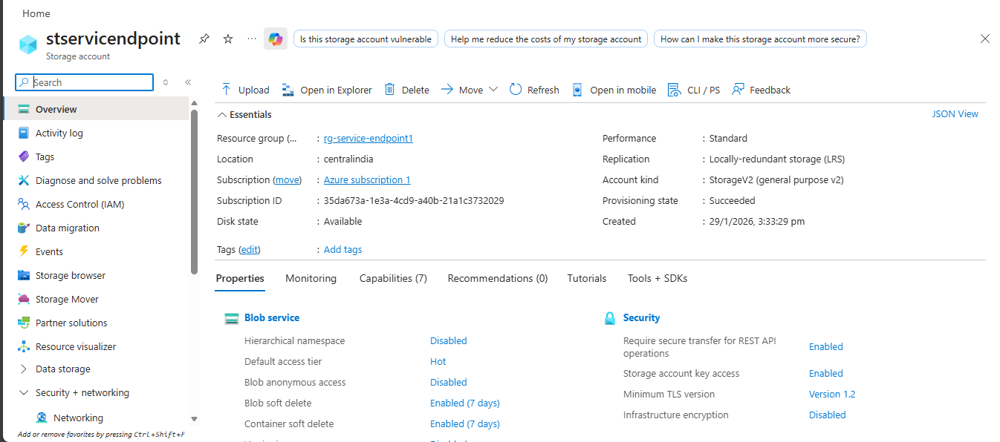
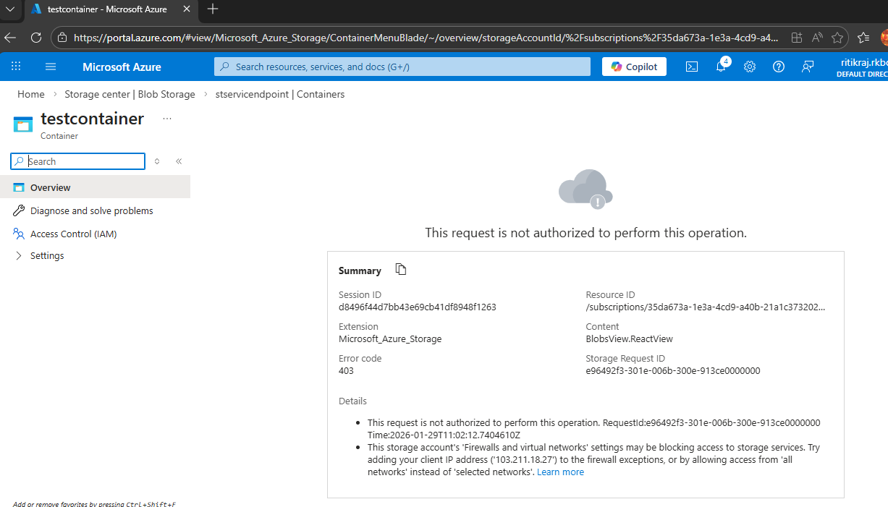

## 🛠 Step-by-Step Implementation

---

## Step 1: Create Resource Group

- **Name:** `rg-service-endpoint1`
- **Region:** Central India

---

## Step 2: Create Virtual Network & Subnet

**Azure Portal → Virtual Network → Create**

### Basics
- Resource Group: `rg-service-endpoint1`
- VNet Name: `vnet-service-endpoint`
- Region: Central India

### Address Space
- `10.0.0.0/16`

### Subnet
- Name: `AppSubnet`
- Address Range: `10.0.2.0/24`

---

## Step 3: Enable Service Endpoint on Subnet

1. Open **Virtual Network**
2. Go to **Subnets → AppSubnet**
3. Under **Service Endpoints**
4. Select:
   - ✅ `Microsoft.Storage`
5. Click **Save**

📌 This allows the subnet to access Azure Storage securely.

---
## Step 4: Create Azure Storage Account
1. Storage Accounts → Create
2. Basics:
   - Name: stservicendpoints
   - Region: Same as VNet
   - Performance: Standard
   - Redundancy: LRS

📸 Screenshot:  

---

## Step 5: Restrict Storage Access to Subnet Only

1. Open **Storage Account**
2. Go to **Networking**
3. Select **Public network access → Manage**
4. Under **Public network scope**:
   - ✅ Enable from **Selected networks**
5. Under **Virtual networks**:
   - Add existing VNet
   - VNet: `vnet-service-endpoint`
   - Subnet: `AppSubnet`
6. Click **Save**

📌 Storage is now **NOT accessible from the internet**.

---

## Step 6: Deploy VM for Testing

Create a **Windows or Linux VM**:

- Resource Group: `rg-service-endpoint1`
- VNet: `vnet-service-endpoint`
- Subnet: `AppSubnet`
- Region: Central India

---

## 🧪 Step 7: Validation & Testing

---

### ❌ Test 1: From Local PC (Should FAIL)

1. Go to **Azure Portal**
2. Open **Storage Account**
3. Click **Containers**
4. Try:
   - Create container **OR**
   - Upload a file

**Expected Result:**

📸 Screenshot:  

---

### ✅ Test 2: From VM in AppSubnet (Should PASS)

#### Windows VM Test

1. RDP into the VM
2. Open browser
3. Go to: https://portal.azure.com
4. Open **Storage Account → Containers**
5. Try:
   - Create container
   - Upload file

**Expected Result:**
- ✔ Upload works
- ✔ Container opens normally

📸 Screenshot:  

📌 This confirms **Service Endpoint is working correctly**.
