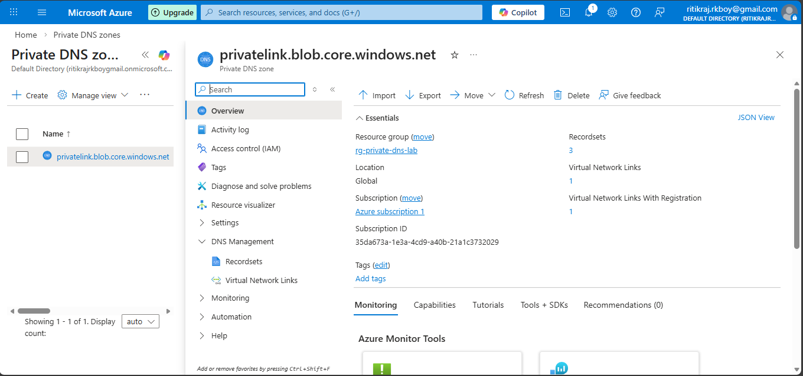
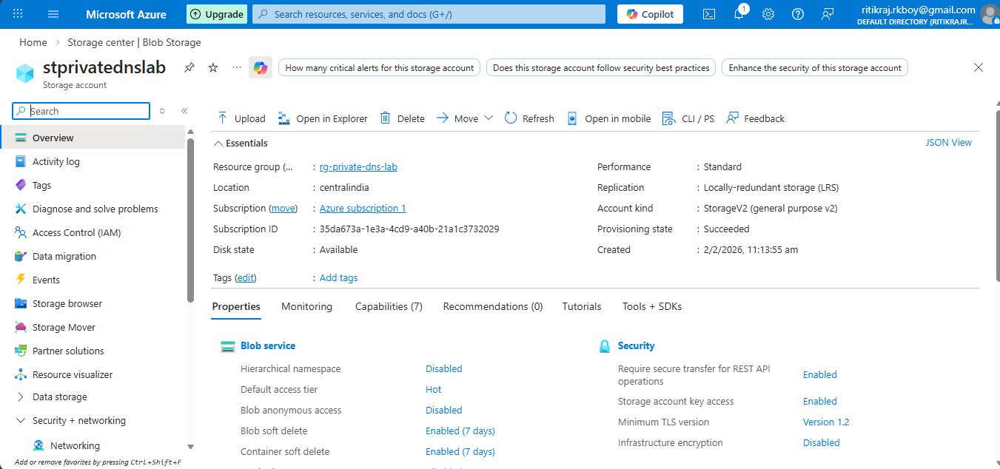
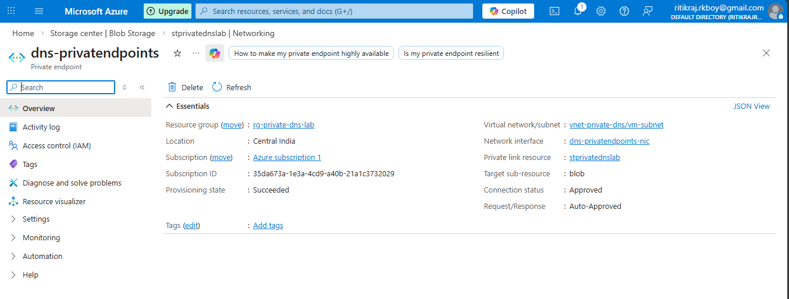
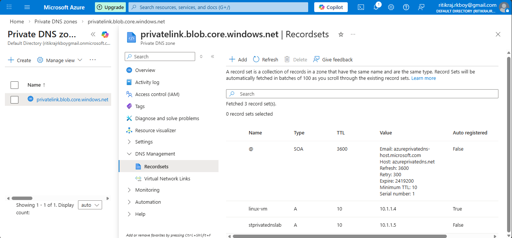
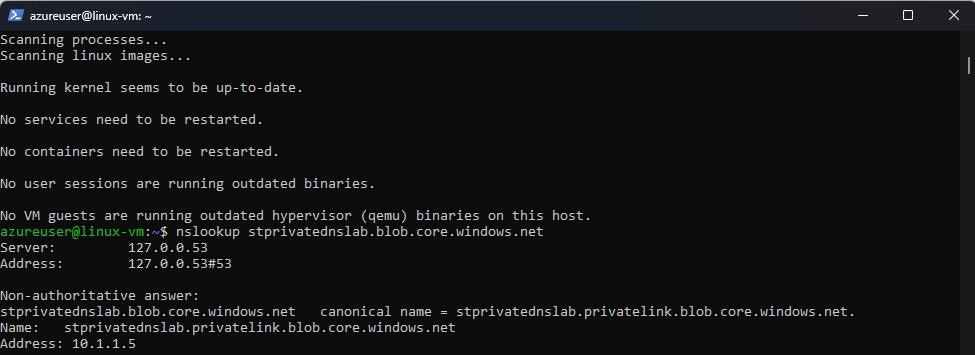

## 🛠 Step-by-Step Implementation

### 🔹 Step 1: Create Resource Group
- Name: `rg-private-dns-lab`
- Region: `Central India`

---

### 🔹 Step 2: Create Virtual Network
- VNet: `vnet-private-dns`
- Address Space: `10.1.0.0/16`
- Subnet: `vm-subnet (10.1.1.0/24)`

---

### 🔹 Step 3: Create Virtual Machine
- Linux or Windows VM
- Deployed inside `vm-subnet`
- Resource group: `rg-private-dns-lab`
- Used to test DNS resolution

---

### 🔹 Step 4: Create Private DNS Zone
Private DNS Zone name (for Storage Account Blob): privatelink.blob.core.windows.net

📸 Screenshot:  

---

### 🔹 Step 5:- Link Private DNS Zone to VNet
> Inside Private DNS Zone → Virtual Network Links → Add
- Link name: vnet-link
- Virtual network: vnet-private-dns
- Enable:
      ✅ Auto registration (optional, but recommended)

---

### 🔹 Step 6:- Create Azure PaaS Service (Example: Storage Account)
> Azure Portal → Storage Accounts → Create
- Name: stprivatednslab
- Networking:
	- Public access: Disabled
- Create storage account

📸 Screenshot:  

---

### 🔹 Step 7: Create Private Endpoint
- Target: Storage Account (Blob)
- Subnet: `vm-subnet`
- DNS Integration:
  - Link to existing Private DNS Zone
  - Select: privatelink.blob.core.windows.net
  - Auto-create DNS A record

📸 Screenshot:  

---

### 🔹 Step 8: Verify DNS Record
Inside Private DNS Zone → Record Sets: StorageAccountName → 10.1.1.x

✅ This confirms private DNS mapping.

📸 Screenshot:  

---

### 🔹 Step 9: Test DNS Resolution (Validation)

From the Linux or Windows VM:

``bash
nslookup stprivatednslab.blob.core.windows.net

📸 Screenshot:  

### ✅ Expected Output
- CNAME → privatelink.blob.core.windows.net
- Resolves to private IP
- No public IP returned
