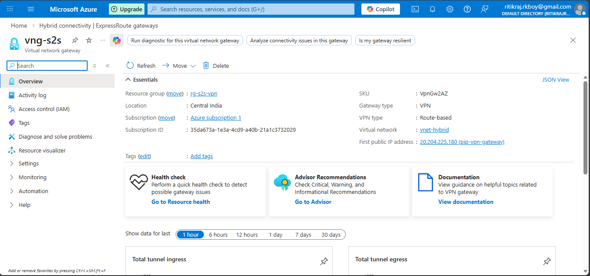
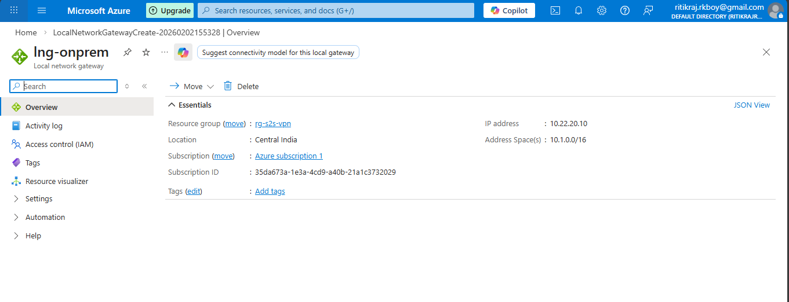
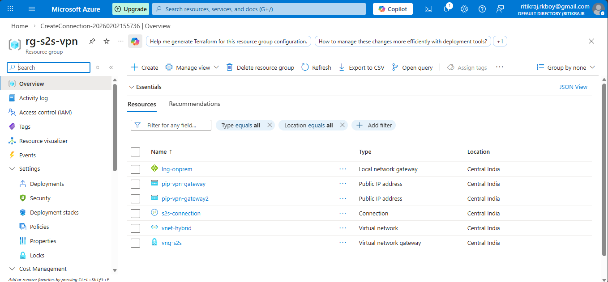

## 🛠 Step-by-Step Implementation

## 🔹 Step 1: Create Resource Group
- **Name:** rg-s2s-vpn
- **Region:** Central India

---

## 🔹 Step 2: Create Virtual Network
- **Name:** vnet-hybrid
- **Address Space:** 10.0.0.0/16

### Subnets
| Subnet Name     | Address Range     |
|-----------------|------------------|
| AppSubnet       | 10.0.1.0/24      |
| GatewaySubnet   | 10.0.255.0/27    |

📌 **GatewaySubnet is mandatory for VPN Gateway deployment**

---

## 🔹 Step 3: Create Public IP for VPN Gateway
- **Name:** pip-vpn-gateway
- **SKU:** Standard
- **Assignment:** Static

---

## 🔹 Step 4: Create Virtual Network Gateway
- **Name:** vng-s2s
- **Gateway Type:** VPN
- **VPN Type:** Route-based
- **SKU:** VpnGw1
- **Virtual Network:** vnet-hybrid
- **Public IP:** pip-vpn-gateway

⏳ Deployment time: **30–45 minutes**

📸 Screenshot:  

---

## 🔹 Step 5: Create Local Network Gateway (On-Prem Simulation)
Represents the on-premises network.

- **Name:** lng-onprem
- **IP Address:** 20.50.60.70 (Simulated public IP)
- **Address Space:** 10.1.0.0/16

📌 In real environments, this is the **on-prem firewall public IP**

📸 Screenshot:  

---

## 🔹 Step 6: Create Site-to-Site VPN Connection
- **Connection Name:** s2s-connection
- **Type:** Site-to-Site
- **Virtual Network Gateway:** vng-s2s
- **Local Network Gateway:** lng-onprem
- **Shared Key (PSK):** Azure@123

📌 Same key must be configured on the on-prem VPN device

📸 Screenshot:  

---

## 🔹 Step 7: Configure IPsec / IKE Policies (Optional – Enterprise)
- **IKE Version:** IKEv2
- **Encryption:** AES256
- **Integrity:** SHA256
- **DH Group:** 14

---

## 🔹 Step 8: Simulate On-Prem Network
Options:
- Deploy an **Azure VM** acting as on-prem
- OR use this setup for **theoretical / exam practice**

---

## 🔹 Step 9: Validation & Testing
- VPN Connection Status: **Connected**
- Deploy a VM in Azure AppSubnet
- Test:
  - Ping
  - RDP (Windows)
  - SSH (Linux)

---

## ✅ Final Outcome
✔ Hybrid connectivity established  
✔ Secure IPsec-encrypted tunnel  
✔ AZ-104 enterprise networking scenario completed  
