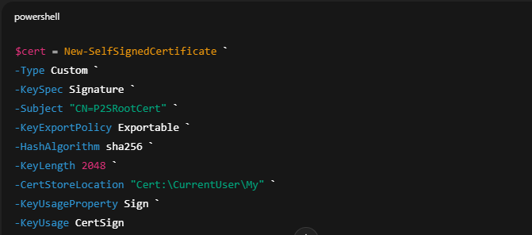
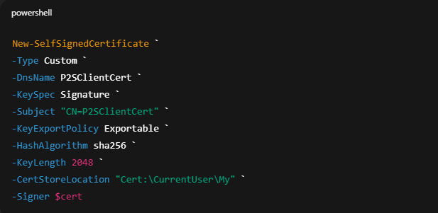

# 🚀 Deployment Guide – Azure Point-to-Site (P2S) VPN

---

# STEP 1: Create Resource Group

- Name: `rg-p2s-vpn`
- Region: `Central India`

Purpose: Logical container for all VPN resources.

---

# STEP 2: Create Virtual Network

## Virtual Network

- Name: `vnet-p2s`
- Address Space: `10.0.0.0/16`

## Subnets

| Name | Address |
|------|----------|
| AppSubnet | 10.0.1.0/24 |
| GatewaySubnet | 10.0.255.0/27 |

⚠ GatewaySubnet name must be exactly **GatewaySubnet**

Purpose: Required for VPN Gateway deployment.

---

# STEP 3: Create VPN Gateway

Fill the following details:

- Name: `vpngw-p2s`
- Gateway Type: VPN
- VPN Type: Route-Based
- SKU: VpnGw1
- Generation: Generation1
- Virtual Network: vnet-p2s
- Public IP: Create New

⏳ Deployment time: 30–45 minutes

Purpose: Enables encrypted VPN connectivity.

---

# STEP 4: Create Certificates (Local Machine Only)

⚠ Do NOT use Azure Cloud Shell

## Create Root Certificate

Run PowerShell as Administrator:

``powershell

📸 Screenshot:  

## Export Root Certificate (Public Key Only)
- Open certmgr.msc
- Personal → Certificates
- Right-click P2SRootCert
- Export → No private key
- Select Base-64 encoded (.cer)
- Save as P2SRootCert.cer

## Create Client Certificate

📸 Screenshot:  

Purpose: Used by your local device to authenticate.

---

# STEP 5: Configure Point-to-Site (P2S) VPN

Navigate to:

Azure Portal → VPN Gateway → **Point-to-site configuration**

Configure the following settings:

| Setting | Value |
|----------|--------|
| Address Pool | 172.16.0.0/24 |
| Tunnel Type | IKEv2 + SSTP |
| Authentication | Certificate |
| Root Certificate Name | P2SRootCert |
| Public Cert Data | Paste full content of exported `.cer` file |

⚠ **Important:**  
The address pool must NOT overlap with the VNet address space (10.0.0.0/16).

Click **Save** after configuration.

---

# STEP 6: Download VPN Client

1. Go to **VPN Gateway**
2. Click **Download VPN Client**
3. Extract the downloaded ZIP file
4. Run the installer inside the extracted folder

After installation, the VPN profile will appear in:

Windows Settings → Network → VPN

---

# STEP 7: Connect from Local Machine

1. Open **Windows Settings**
2. Go to **Network & Internet → VPN**
3. Select the Azure VPN profile
4. Click **Connect**

### Expected Result:
✔ Status shows **Connected**

This confirms the encrypted tunnel is successfully established.

---

# STEP 8: Deploy Test VM (No Public IP)

Create a virtual machine to validate private access.

| Setting | Value |
|----------|--------|
| VM Name | vm-admin |
| Subnet | AppSubnet |
| Public IP | None |
| NSG Rule | Allow RDP (3389) or SSH (22) from Virtual Network |

### Purpose:
Validate private connectivity through the VPN tunnel.

---

# STEP 9: Test Access (Final Validation)

From your local laptop (while VPN is connected):

- RDP to VM **Private IP**
- Ping VM **Private IP**
- Access internal applications/services

---

## ✅ Final Success Criteria

✔ VPN Status = Connected  
✔ VM accessible via Private IP  
✔ No Public IP exposure  
✔ Secure encrypted administrative access  

